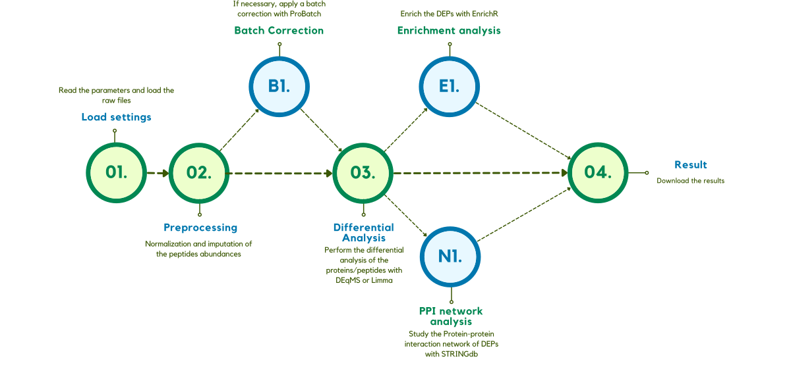
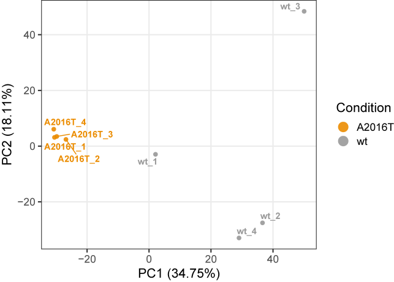
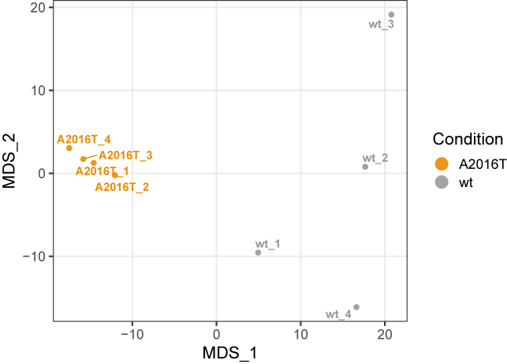
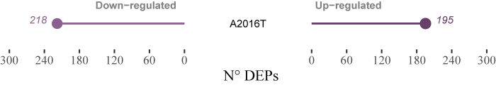
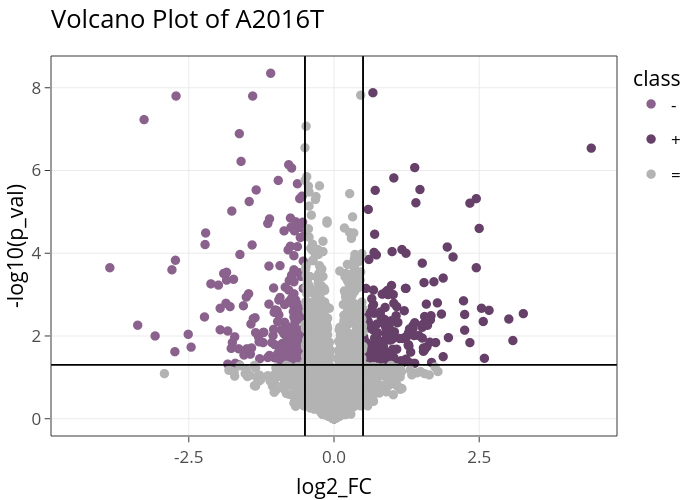
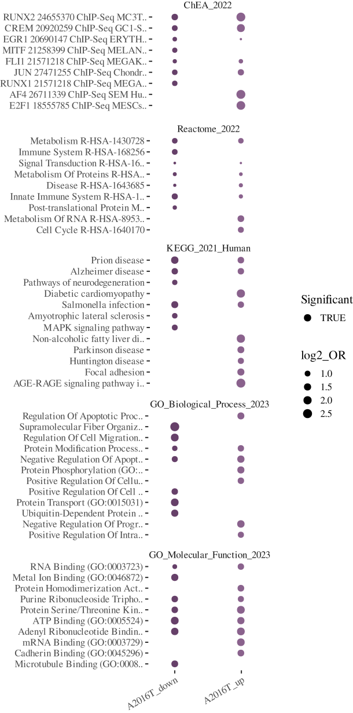
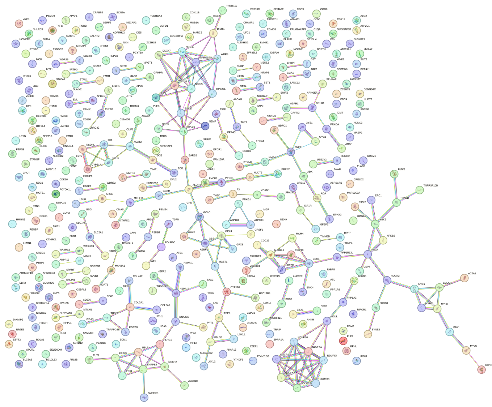
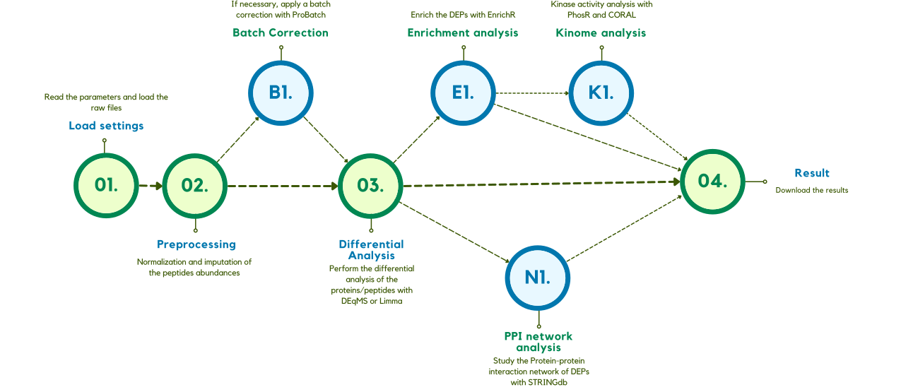
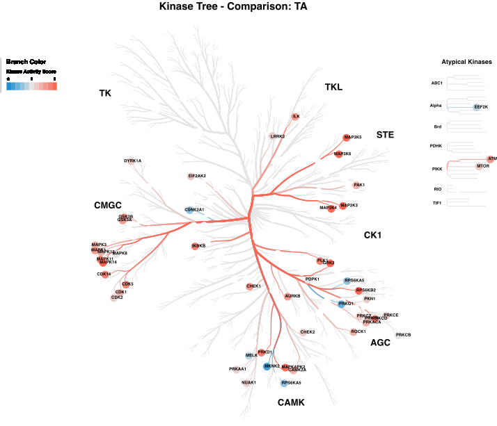

[](https://github.com/gabrieletome/proTN_package/actions/workflows/R-CMD-check.yaml)

# ProTN

ProTN is an R package that provides an integrated pipeline for complete downstream analysis of proteomics, phospho-proteomics, and interactomics data following peptide quantification. It is compatible with MS-based proteomic experiments processed using Proteome Discoverer and MaxQuant, two of the most widely used platforms for extracting peptide abundances from raw MS spectra. For proteome and interactomics analyses, ProTN also supports input files generated by FragPipe and Spectronaut.

ProTN is designed to be user-friendly, fast, and comprehensive, offering high-quality visualizations and tables to support the biological interpretation of results.

All required information can be found on the info page of the web app.

## Before starting

### Dependencies

ProTN requires R version \>= 4.1.

## Installation

To install the `proTN` package directly from GitHub, the `devtools` package is required. If not already installed on your system, run:

``` r
install.packages("devtools")
```

Next, load `devtools` and install `proTN` using:

``` r
library(devtools)
devtools::install_github("gabrieletome/proTN_package", dependencies = TRUE)
```

## Loading the package

Once installed, load `proTN`:

``` r
library(proTN)
```

NOTE: If during installation an error about missing dependencies occurs, install the packages manually using the following code:

``` r
if (!require("BiocManager", quietly = TRUE))
  install.packages("BiocManager")
  
BiocManager::install("SummarizedExperiment")
BiocManager::install("STRINGdb")
BiocManager::install("DEqMS")
BiocManager::install("limma")
BiocManager::install("preprocessCore")

devtools::install_github("symbioticMe/proBatch", dependencies = T)
devtools::install_github("PYangLab/PhosR", dependencies = T)
```

## Case study example

The example used for the vignettes can be opened with the `extract_example` function:

**Note**: The case study reported is a comparison of polysome-associated proteins with total proteins in human MCF7 cells. (PRIDE: PXD009417) (Clamer M, Tebaldi T, Lauria F, et al. Active Ribosome Profiling with RiboLace. Cell Rep. 2018;25(4):1097-1108.e5.)

#### Proteomic dataset

``` r
extract_example(path_proteome = "path_to_save")
```

#### Phospho-proteomic dataset

``` r
extract_example(path_phospho = "path_to_save")
```

#### Phospho-proteomic dataset with proteome input

``` r
extract_example(path_proteome = "path_to_save", 
                path_phospho = "path_to_save")
```

## Vignette

Vignettes for all 3 workflows (proteomics, phospho-proteomics, and phospho-proteomics with proteome) are available. Build them using devtools:

``` r
devtools::build_vignettes("proTN")
```

## Workflow description

### ProTN

ProTN is an integrative pipeline that analyzes DDA proteomics data obtained from MS. It performs a complete analysis of raw files from different software, with biological interpretation through enrichment and network analysis. ProTN executes dual-level analysis at the protein and peptide levels.



#### Set settings for the execution and read the raw data from loaded files

ProTN analyzes the results of Proteome Discoverer and MaxQuant. The essential parameters and files to run ProTN are: (additional details on the input can be found in the ProTN info tab)

-   **Software Analyzer**: Determines which software was used to identify peptides and proteins.
    -   **PD**: Proteome Discoverer
    -   **MQ**: MaxQuant
    -   **SP**: Spectronaut
    -   **FP**: FragPipe

##### Files required for Proteome Discoverer
-   `Annotation file`: This file provides metadata for the samples analyzed. It must be an Excel file with the following required columns:

    | Column Name | Description                                                               |
    | ----------- | ------------------------------------------------------------------------- |
    | `File ID`   | Identifier used in column headers of the peptide file. |
    | `Condition` | Experimental group name. Used for comparisons.                            |
    | `Sample`    | Clean sample name used downstream.                                        |
    | `color`     | (Optional) Plot color. Defaults are applied if missing.                   |
    | `batch`     | (Optional) Batch ID for batch effect correction.                          |
-   `Peptides file`: Excel table with annotated peptides and abundance values.

    | Column Name                    | Description                                                   |
    | ------------------------------ | ------------------------------------------------------------- |
    | `Master Protein Accessions`    | Maps peptide to protein; only the first ID is kept.               |
    | `Annotated Sequence`           | Amino acid sequence including PTM annotations.                |
    | `Modifications`                | Post-translational modifications. |
    | `Positions in Master Proteins` | Position of peptide in the protein sequence.                  |
    | `Abundance: <File ID>`          | Intensity/abundance for each sample. One column per sample.   |
-   `Proteins file`: Excel table containing descriptive and accession information for proteins.

    | Column Name   | Description                                                |
    | ------------- | ---------------------------------------------------------- |
    | `Accession`   | Unique protein identifier, used to join with peptide file. |
    | `Description` | Descriptive string, e.g., from UniProt.                    |

##### Files required for MaxQuant
-   `Annotation file`: This file provides metadata for the samples analyzed. It must be an Excel file with the following required columns:

    | Column Name | Description                                                                                  |
    |----------------|--------------------------------------------------------|
    | `Condition` | Experimental condition (e.g., Control, Treated). Used for group comparison.                   |
    | `Sample`    | Sample identifier. Must match sample names in the peptide file.                              |
    | `color`     | (Optional) Color associated with the condition. If not present, default colors are assigned. |
    | `batch`     | (Optional) Batch ID for batch effect correction. Required if batch correction is enabled.    |
-   **Evidence pipeline**:
    -   `evidence.txt`: This is a TSV/CSV file containing peptide-level quantification data. **Required columns:**

        | Column Name              | Description                                                                 |
        |--------------------------|-----------------------------------------------------------------------------|
        | `Sequence`               | Amino acid sequence of the peptide.                                          |
        | `Modifications`          | PTMs of the peptide.             |
        | `Gene names`             | Gene symbol associated with the peptide.     |
        | `Protein names`          | Protein description. If missing, will be merged from annotation file.       |
        | `Leading razor protein`  | UniProt accession. Used for annotation enrichment.                          |
        | `Raw file`               | File/sample ID. Must match entries in the annotation file.                   |
        | `Intensity`              | Peptide intensity value. Used for quantification.                            |
        | `Leading proteins`       | Used for filtering out contaminants (e.g., "CON_").                          |
    -   **Peptide and ProteinGroups pipeline**:
    -   `peptides.txt`: Tab-delimited file with peptide-level quantification. **Required columns:**
        
        | Column Name              | Description                                                                 |
        |--------------------------|-----------------------------------------------------------------------------|
        | `Sequence`               | Amino acid sequence of the peptide.                                          |
        | `Gene names`             | If missing, inferred from `Leading razor protein`.    |
        | `Protein names`          | Protein description. If missing, will be merged from annotation file.       |
        | `Leading razor protein`  | UniProt accession. Used for annotation enrichment.                          |
        | `Intensity <Sample>`          | Intensity values for each sample (e.g., `Intensity Sample1`).            |
    -   `proteinGroups.txt`: Tab-delimited file providing protein-level information. **Required columns:**
    
        | Column Name              | Description                                                                 |
        |--------------------------|-----------------------------------------------------------------------------|
        | `Majority protein IDs`   | Used to extract the `Leading razor protein`. |
        | `Fasta headers`          | Used for protein description.            |


##### Files required for Spectronaut
-   `Annotation file`: (Optional) If provided, this file should contain metadata for each sample. If not provided, the pipeline will extract sample annotations directly from the peptide file.

    | Column Name     | Description                                                                 |
    |----------------|-----------------------------------------------------------------------------|
    | `Condition`     | Experimental group label. Used for comparisons between conditions.           |
    | `Sample`        | Sample identifier. Must match entries in the peptide file.                  |
    | `color`         | (Optional) Color for visualization. Default colors will be assigned if missing. |
    | `batch`         | (Optional) Batch ID for batch correction. Required if batch correction is enabled. |
-   `Spectronaut report`: This is a TSV/CSV file containing peptide-level data. **Required columns:**

    | Column Name              | Description                                                                 |
    |--------------------------|-----------------------------------------------------------------------------|
    | `PG.ProteinAccessions`   | Protein group accessions.                        |
    | `PEP.StrippedSequence`   | Peptide sequence without modifications.                                     |
    | `EG.ModifiedSequence`    | Peptide sequence with modifications.           |
    | `PEP.Quantity`           | Peptide quantification value.                                               |
    | `R.FileName`             | Sample identifier (column used is defined by `sample_col`).                 |
    | `R.Condition`             | Condition identifier (column used if `annotation file` not provided).      |

##### Files required for FragPipe
-   `Annotation file`: This file provides metadata for the samples analyzed. It must be an Excel file with the following required columns:

    | Column Name | Description                                                                                  |
    |----------------|--------------------------------------------------------|
    | `Condition` | Experimental condition (e.g., Control, Treated). Used for group comparison.                   |
    | `Sample`    | Sample identifier. Must match sample names in the peptide file.                              |
    | `color`     | (Optional) Color associated with the condition. If not present, default colors are assigned. |
    | `batch`     | (Optional) Batch ID for batch effect correction. Required if batch correction is enabled.    |
-   `combined_modified_peptide.tsv`: The peptide quantification file must contain raw or normalized intensity values for each sample and peptide. **Required columns:**

    | Column Name              | Description                                                                 |
    |--------------------------|-----------------------------------------------------------------------------|
    | `Protein ID`             | Protein accession or identifier.               |
    | `Protein Description`    | Descriptive name of the protein.                 |
    | `Gene`                   | Gene symbol.                                             |
    | `Peptide Sequence`       | Amino acid sequence of the peptide.                                         |
    | `Assigned Modifications` | Sequence with nucleotide modifications.                            |
    | `Prev AA` | Used to determine tryptic condition.                            |
    | `Next AA` | Used to determine tryptic condition.                            |
    | `<Sample> Intensity`     | One column per sample named like `<Sample> Intensity`.                     |


#### Normalization and imputation of intensities

The intensities are log2-transformed and normalized with DEqMS (Zhu 2022). Two methods are applied because double normalization is required: one for peptides and one for proteins. At the peptide level, normalization is done using the equalMedianNormalization function, which normalizes intensity distributions in samples so that they have a median equal to 0.

At the protein level, this operation is executed using the medianSweeping function. It applies the same median normalization used for peptides and also summarizes peptide intensities into protein relative abundance using the median sweeping method.

Imputation: 
- **PhosR**: Imputation is performed on peptide and protein abundances using the Bioconductor package PhosR. Round imputation is performed in the absence of replicates. ProTN uses two functions from PhosR for imputation: it imputes missing values for a peptide across replicates within a single condition and applies a tail-based imputation approach as implemented in Perseus.
- **Gaussian Estimation**: Imputation is performed on peptide and protein abundances using Gaussian estimation, where missing values are sampled from a normal distribution defined by the mean and standard deviation of observed intensities. This preserves data variance and reduces bias from missingness within conditions.
- **missForest**: Imputation is performed on peptide and protein abundances using the missForest R package, which applies a non-parametric random forest algorithm to predict missing values. This approach captures nonlinear relationships between features, preserving complex data structures.
- **pcaMethods**: Imputation is performed on peptide and protein abundances using the pcaMethods R package with the svdImpute function, which estimates missing values by reconstructing the data matrix from its leading singular vectors. This approach leverages global correlation structures to provide consistent estimates.

| Method | Package | Main Idea | Typical Use |
|--------|---------|-----------|-------------|
| **PhosR imputation** | [PhosR](https://www.sciencedirect.com/science/article/pii/S221112472100084X) (Bioconductor) | Designed for phosphoproteomics; implements *round-robin* (iterative imputation without replicates) and *paired tail-based imputation* (using replicate structure). | Phosphoproteomics with sparse coverage or missingness tied to peptide abundance. |
| **Gaussian estimation imputation** |  | Draws values from a Gaussian distribution defined by the low-intensity tail of observed data (shifted mean, reduced SD). | When MNAR (Missing Not At Random) is likely due to detection limit. |
| **missForest** | [missForest](https://doi.org/10.32614/CRAN.package.missForest) (R) | Non-parametric iterative imputation using random forests. Predicts missing entries using nonlinear relationships between features. | General proteomics where missingness relates to multiple covariates, or when structure is complex. |
| **pcaMethods `svdImpute`** | [pcaMethods](https://bioconductor.org/packages/release/bioc/html/pcaMethods.html) (Bioconductor) | Uses Singular Value Decomposition to reconstruct missing values from lower-rank structure in the data. | Well-replicated datasets with high correlation between samples. |


In this step, two MDSs and two PCAs (proteins and peptides) are generated.

 

#### Statistical differential analysis

The workflow continues with the differential analysis. This phase is applied to proteins and peptides to obtain significant proteins and peptides. Two slightly different methodologies are applied: DEqMS (Zhu 2022) is used for proteins, while the Limma package (Ritchie et al. 2015) is used for peptides. DEqMS is developed on top of Limma but estimates different prior variances for proteins quantified by different numbers of PSMs/peptides per protein, thereby achieving better accuracy.

Limma and DEqMS calculate DEPs for each comparison in the design file parameter. Each peptide or protein has different parameters: the log2 Fold Change, the P.Value, the adjusted P.Value, and log2 expression. In this pipeline, a protein/peptide is significant if it passes 3 thresholds. A protein/peptide for each comparison can be up-regulated or down-regulated. It is up-regulated if:

-   the log2 FC is higher than the Fold Change threshold (FC \> Log2 FC thr),
-   the P.Value is lower than the threshold (P.Value \< P.Value thr).

It is down-regulated if:

-   the log2 FC is lower than the Fold Change threshold (FC \< -Log2 FC thr),
-   the P.Value is lower than the threshold (P.Value \< P.Value thr).

In the output, for each comparison, this distinction is reported in the "class" column, which takes the value "+" if up-regulated, "-" if down-regulated, and "=" if not significant.

Various figures are generated: first, a bar plot that graphically represents the identified DEPs, followed by comparison-specific volcano plots.



<hr>



#### Report creation and download of results

The results are summarized in a web-page HTML report. Additionally, the experiment is described by a large number of files; a description of each generated file can be found in section 4 (Details on the output files). All files are grouped in a zip file and downloaded.

.png)

#### ADDITIONAL STEPS:

##### B1. Batch Effect correction

If required by the experiment, a batch correction step can be applied using proBatch (Cuklina et al. 2018). The batches need to be defined in the Sample_Annotation file where the MS_batch column is required.

##### E1. Enrichment analysis of Differentially Expressed Proteins

The biological interpretation of Differentially Expressed Proteins begins with the enrichment step. To execute this analysis, ProTN uses EnrichR (Jawaid 2022), a widely used tool that searches a large number of datasets to obtain information about many categories. EnrichR organizes its hundreds of datasets into 8 sections: Transcription, Pathways, Ontologies, Diseases/Drugs, Cell Types, Misc, Legacy, and Crowd.

Since the analysis that a user wants to perform can be different, each comparison has 3 sets of proteins: the up-regulated (called Up), the down-regulated (called Down), and the set (called all) obtained by merging Up- and Down-regulated proteins. EnrichR provides much information for each term. It returns statistical parameters like P.Value, fdr, odds ratio, and combined score. At the same time, it provides the overlap size, the number of genes in the term, and the genes from the input list found in the term.

The large amount of data downloaded from EnrichR is exported in two formats. The tool creates an RData file of the complete data frame, allowing users to easily import it into R for further analysis and plotting. It also generates an Excel file with only the significant terms. The process uses filters defined in the options file to differentiate relevant terms from the overall dataset.

For a term to be significant, it must have:
- a P.Value lower than the P.Value threshold for enrichment (P.Value \< P.Value thr for enrichment),
- an Overlap Size higher than the Overlap size threshold for enrichment (Overlap Size \> Overlap size thr for enrichment).

Besides that, the pipeline plots the enrichment results in different figures. The 4 plots can be split into 2 categories. The first two are filtered on datasets and illustrate only the datasets written in the DB column to analyze in the options file. The other 2 are filtered on words to search in the term description, using the list of words in the Terms to search column.



##### N1. Protein-Protein Interaction network analysis of Differentially Expressed Proteins

The last analytical step is Protein-Protein Interaction (PPI) network analysis, since PPIs are essential in almost all cellular processes and crucial for understanding cell physiology in different states. For each comparison, ProTN analyzes the interactions between DEPs using STRING (Szklarczyk et al. 2021).



### PhosProTN

PhosProTN is an integrative pipeline for phosphoproteomic analysis of DDA experimental data obtained from MS. It performs a complete analysis of raw files from Proteome Discoverer (PD) or MaxQuant (MQ), with biological interpretation, enrichment, and network analysis. PhosProTN analyzes phosphoproteomic data at the peptide level.



*The phospho-workflow is similar to the one described previously; below are reported only the different steps.*

#### Set settings for the execution and read the raw phospho data from loaded files

ProTN analyzes the results of Proteome Discoverer and MaxQuant. The essential parameters and files to run ProTN are: (additional details on the input can be found in the ProTN info tab)

-   **Software Analyzer**: Determines which software was used to identify peptides and proteins.

    -   **PD**: Proteome Discoverer
    -   **MQ**: MaxQuant

##### Files required for Proteome Discoverer

-   `Annotation file`: This file provides metadata for the samples analyzed. It must be an Excel file with the following required columns:

    | Column Name | Description                                                               |
    | ----------- | ------------------------------------------------------------------------- |
    | `File ID`   | Identifier used in column headers of the peptide file. |
    | `Condition` | Experimental group name. Used for comparisons.                            |
    | `Sample`    | Clean sample name used downstream.                                        |
    | `color`     | (Optional) Plot color. Defaults are applied if missing.                   |
    | `batch`     | (Optional) Batch ID for batch effect correction.                          |
-   `Peptides file`: Excel table with annotated peptides and abundance values.

    | Column Name                    | Description                                                   |
    | ------------------------------ | ------------------------------------------------------------- |
    | `Master Protein Accessions`    | Maps peptide to protein; only the first ID is kept.               |
    | `Annotated Sequence`           | Amino acid sequence including PTM annotations.                |
    | `Modifications`                | Post-translational modifications. |
    | `Positions in Master Proteins` | Position of peptide in the protein sequence.                  |
    | `Abundance: <File ID>`          | Intensity/abundance for each sample. One column per sample.   |
-   `Proteins file`: Excel table containing descriptive and accession information for proteins.

    | Column Name   | Description                                                |
    | ------------- | ---------------------------------------------------------- |
    | `Accession`   | Unique protein identifier, used to join with peptide file. |
    | `Description` | Descriptive string, e.g., from UniProt.                    |

-   `PSM file`

    | Column Name                      | Description                                     |
    | -------------------------------- | ----------------------------------------------- |
    | `ptmRS: Best Site Probabilities` | Used to resolve phosphosite ambiguity.          |
    | `Precursor Abundance`            | Abundance value used to filter invalid entries. |
    | `Master Protein Accessions`      | Matches protein IDs for mapping.                |
    | `Annotated Sequence`             | Used to resolve conflicting PTM assignments.    |

##### Files required for MaxQuant
-   `Annotation file`: This file provides metadata for the samples analyzed. It must be an Excel file with the following required columns:

    | Column Name | Description                                                                                  |
    |----------------|--------------------------------------------------------|
    | `Condition` | Experimental condition (e.g., Control, Treated). Used for group comparison.                   |
    | `Sample`    | Sample identifier. Must match sample names in the peptide file.                              |
    | `color`     | (Optional) Color associated with the condition. If not present, default colors are assigned. |
    | `batch`     | (Optional) Batch ID for batch effect correction. Required if batch correction is enabled.    |
-   `evidence.txt`: This is a TSV/CSV file containing peptide-level quantification data. **Required columns:**

    | Column Name              | Description                                                                 |
    |--------------------------|-----------------------------------------------------------------------------|
    | `Modifications`          | PTMs of the peptide.             |
    | `Gene names`             | Gene symbol associated with the peptide.     |
    | `Protein names`          | Protein description. If missing, will be merged from annotation file.       |
    | `Leading razor protein`  | UniProt accession. Used for annotation enrichment.                          |
    | `Raw file`               | File/sample ID. Must match entries in the annotation file.                   |
    | `Intensity`              | Peptide intensity value. Used for quantification.                            |
    | `Phospho (STY) Probabilities` | Used to filter for confident phosphorylation.                          |


#### ADDITIONAL STEPS:

##### K1. Activity kinase tree analysis of Differentially Expressed Phosphosites

The last analytical step is kinase tree analysis. In phosphoproteomics, it is extremely useful to study the activation status of kinases based on differentially expressed substrates identified by differential analysis. For each comparison, PhosProTN predicts the activation state of kinases using PhosR (Kim et al. 2021). PhosR provides a kinase-substrate relationship score and prioritizes potential kinases that could be responsible for phosphorylation changes at phosphosites based on kinase recognition motifs and phosphoproteomic dynamics.

The activity score provided by PhosR is used to generate a graphical version of the human kinome tree using CORAL (Metz K.S. et al. 2018), a web Shiny app for visualizing quantitative and qualitative data. It generates high-resolution scalable vector graphic files suitable for publication without the need for refinement in graphic editing software.



### PhosProTN with proteome background

PhosProTN with proteome background is an integrative pipeline for phosphoproteomic analysis of DDA experimental data obtained from MS. It performs a complete analysis of raw files from Proteome Discoverer (PD) or MaxQuant (MQ), with biological interpretation, enrichment, and network analysis. PhosProTN analyzes phosphoproteomic data at the peptide level using proteome analysis of the same conditions as background.


*The phospho-workflow is similar to the one described previously; below are reported only the different steps.*

#### Set settings for the execution and read the raw data from loaded files

This workflow requires both phosphoproteomic files as described [previously](#set-settings-for-the-execution-and-read-the-raw-phospho-data-from-loaded-files) and the proteome file as described [here](#set-settings-for-the-execution-and-read-the-raw-data-from-loaded-files).

### InteracTN

InteracTN is an integrated pipeline for the analysis of interactomics data derived from DDA mass spectrometry experiments. It supports input from multiple widely used proteomics platforms, including Proteome Discoverer (PD), MaxQuant (MQ), Spectronaut (SP), and FragPipe (FP).
The pipeline also includes network reconstruction and visualization, helping users interpret protein–protein interactions in the context of biological pathways and complexes.
Designed to be robust and user-friendly, InteracTN enables researchers to efficiently explore and interpret interactome data for a deeper understanding of cellular mechanisms and protein functions.

#### Set settings for the execution and read the raw data from loaded files

This workflow requires proteome files as described [here](#set-settings-for-the-execution-and-read-the-raw-data-from-loaded-files).


## Getting help

Bugs and errors can be reported on the GitHub issues page. Before filing new issues, please read the documentation and review currently open and already closed discussions.

## Contacts

Gabriele Tomè, Developer: [gabriele.tome\@unitn.it](mailto:gabriele.tome@unitn.it){.email}

Dr. Toma Tebaldi, PI: [toma.tebaldi\@unitn.it](mailto:toma.tebaldi@unitn.it){.email}
